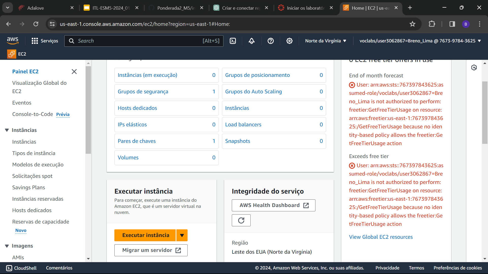
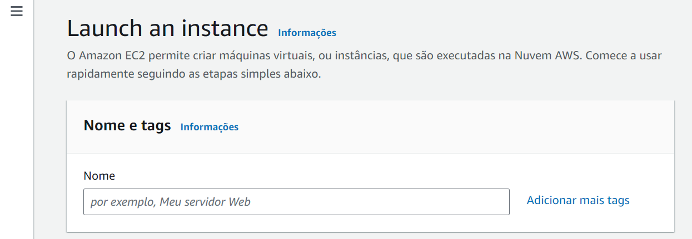
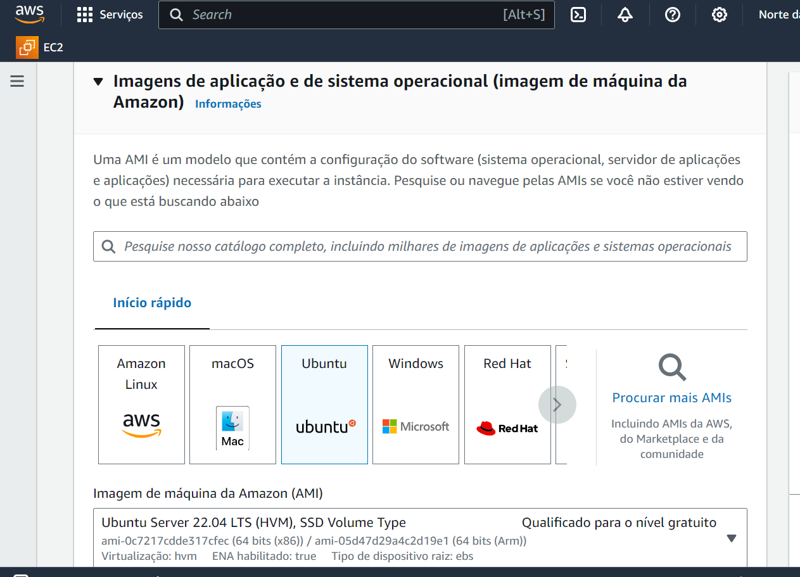
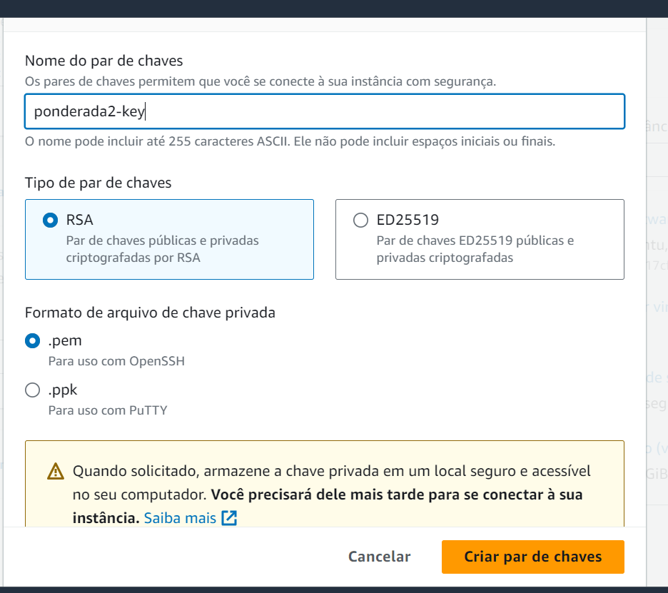
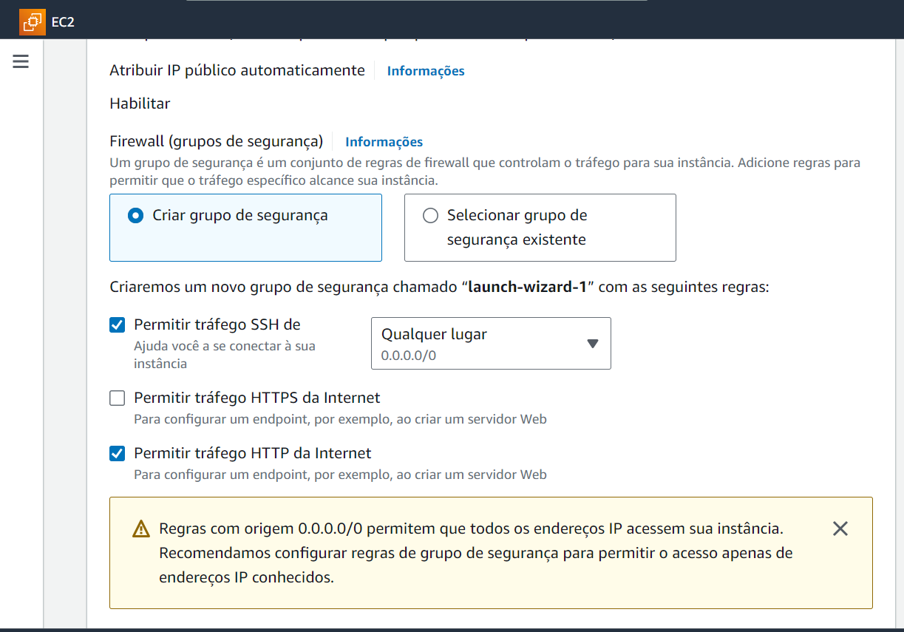
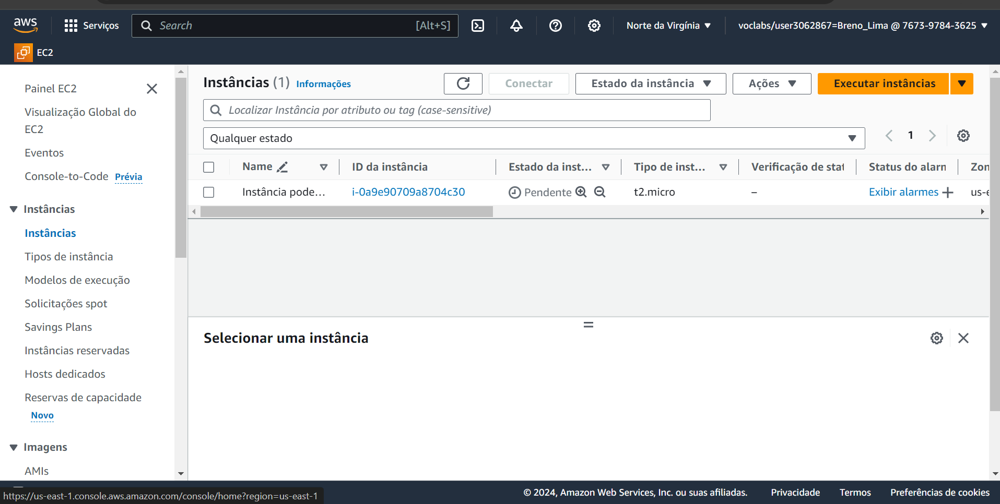
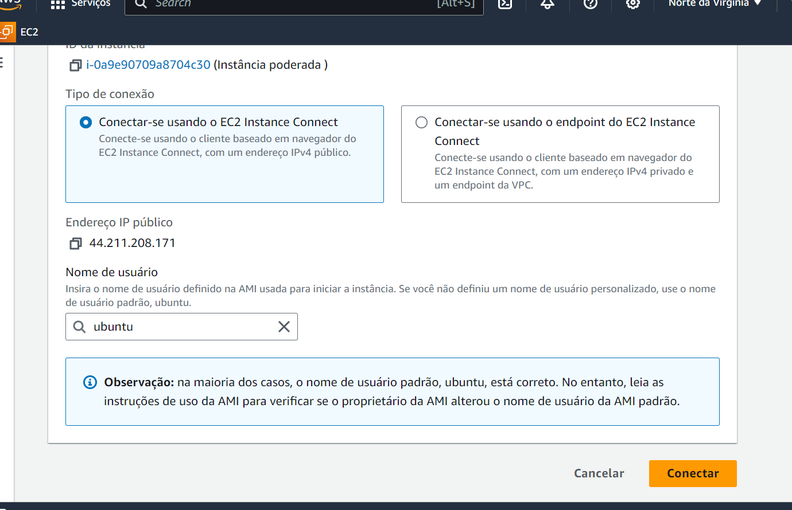
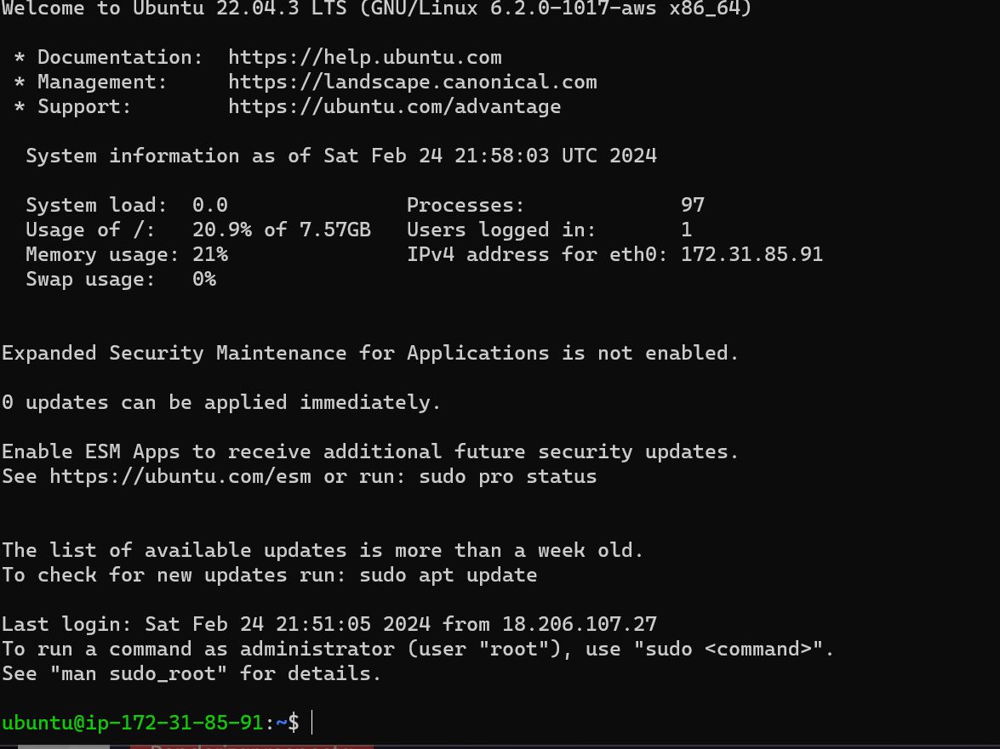
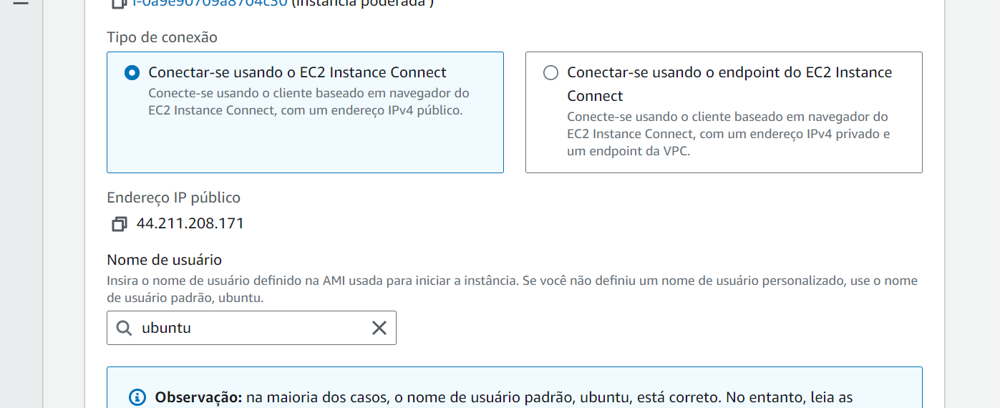

# Introdução 

O Amazon Elastic Compute Cloud (Amazon EC2) é um serviço de computação em nuvem oferecido pela Amazon Web Services (AWS) que disponibiliza capacidade de computação redimensionável na nuvem. Com o Amazon EC2, os usuários podem alugar servidores virtuais, conhecidos como instâncias, e executar aplicativos neles, sem a necessidade de investir em hardware físico. Essas instâncias podem ser configuradas e escaladas conforme necessário, permitindo que os usuários ajustem facilmente a capacidade de computação de acordo com a demanda de seus aplicativos ou serviços. O Amazon EC2 é amplamente utilizado para uma variedade de casos de uso, desde hospedagem de sites simples até execução de cargas de trabalho complexas e de alto desempenho. Neste documento, vamos explorar como conectar-se a uma instância do EC2.

# Objetivo 

O objetivo dessa documentação é relatar meu processo de se conectar em uma instância EC2.

# Materiais

Slide da aula.

# Método

Inicialmente, vamos executar a instância clicando em "Executar Instância":

Depois colocamos um nome na instância:

Selecionamos o Ubuntu:

Criamos um par de chaves:

Permitindo o trafego ssh e http:

Agora apertamos em "Executar instância":

Em "Instâncias" acessamos a instância que acabamos de criar:

E se conectamos a instância:

Após colocar o comando  ssh -i "ponderada2-key.pem" ubuntu@ec2-44-211-208-171.compute-1.amazonaws.com na diretorio das chaves anteriomente criadas, apareceu isso:

IP máquina:

# Resultado

Seguindo os passos acima, consegui realizar a criação da instância como, também se conectar a ela.

# Conclusão 

O que podemos concluir é que para se conectar em uma instância do EC2 precisamos de um par de chave ssh.